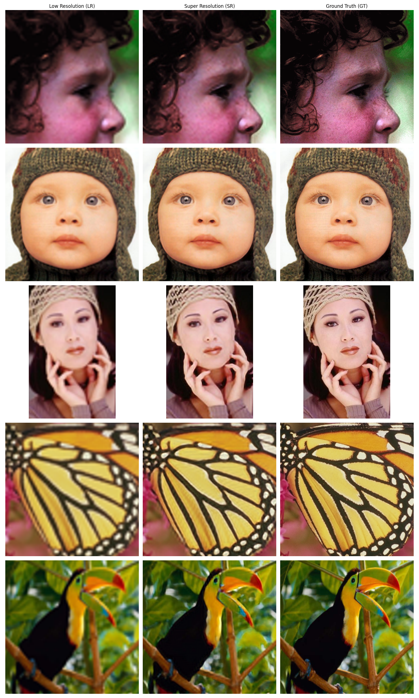

# SRCNN-PyTorch
A pytorch implementation of SRCNN.\
Original Paper: [Image Super-Resolution Using Deep Convolutional Networks](https://arxiv.org/abs/1501.00092) (ECCV 2014)

## Details
- Training data: T91 dataset
- Optimizer: Adam (learning rate = 0.00001)
- Number of iteration: 12,500,000 (2,500 epochs; 5,000 iterations per epoch)
- Chose best scoring model on validation.
- Validation dataset: Set5

### Results (average PSNR on Set5)
| Scale | On Paper | Experiment | Difference |
| :---: | :---: | :---: | :---: |
| 2 | 36.66dB | **36.20**dB | 0.46dB | 
| 3 | 32.75dB | **32.44**dB | 0.31dB |
| 4 | 30.49dB | **30.10**dB | 0.39dB |

| x2 | x3 | x4 |
| :---: | :---: | :---: |
|  |  |  |

## Requirements
- Python: 3.12
- CUDA: 12.2
- PyTorch Build: 2.5.1
```shell
$ pip install torch==2.5.1 torchvision==0.20.1 torchaudio==2.5.1 --index-url https://download.pytorch.org/whl/cu121
$ pip install -r requirments.txt
```

## Run
### Inference
```shell
# Quick inference (Images required in 'inference/input/'; Default scale: 3)
$ python inference.py 

# Example usage
$ python inference.py -m 'pretrained_models/scale-4.BEST_PSNR.pth' -s 4 -i 'inference/input/' -o 'inference/results/'

# Usage
$ python inference.py [-m MODEL] [-s SCALE] [-i IMAGES] [-o OUTPUT]
```
- Pretrained models are located at 'pretrained_models/'

### Train
```shell
# Example usage
$ python train.py --training_data '/data/T91/' --validataion_data '/data/Set5/'

# Usage
$ python train.py [--experiment_dir EXPERIMENT_DIR] [--scale_factor SCALE_FACTOR] [--learning_rate LEARNING_RATE] [--model_path MODEL_PATH] [--epochs EPOCHS] [--training_data TRAINING_DATA] [--validation_data VALIDATION_DATA]
```
- Experiment results will be exported to 'experiments/' by default.
- Model will be fine-tuned after pretrained model if MODEL_PATH is given.